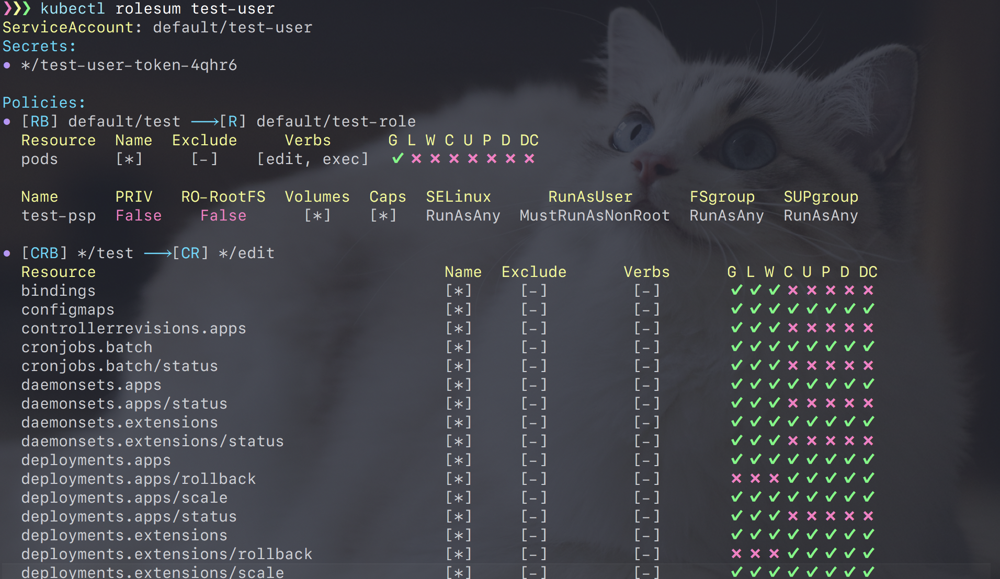

# kubectl-bindrole

Summarize RBAC roles for the specified subject (ServiceAccount, User and Group).



## Installation

### for macOS

bindrole supports [homebrew](https://docs.brew.sh/Installation) :beer:

```
brew tap Ladicle/kubectl-bindrole
brew install kubectl-bindrole
```

### for other devices

The easiest way is to download binary from the [release page](https://github.com/Ladicle/kubectl-bindrole/releases).
You can also download this repository and install it using Makefile.

## Usage

```bash
$ kubectl bindrole -h  # or kubectl-bindrole -h
Summarize RBAC roles for the specified subject

Examples:
  # Summarize roles tied to the "ci-bot" ServiceAccount.
  kubectl-bindrole ci-bot

  # Summarize roles tied to the "developer" Group.
  kubectl-bindrole developer -k Group

Options:
  -k, --subject-kind='ServiceAccount': subject kind (available: ServiceAccount, Group or User)
      --version=false: version for kubectl-bindrole

Usage:
  kubectl-bindrole <SubjectName> [options]

Use "kubectl-bindrole options" for a list of global command-line options (applies to all commands).
```

This command supports both kubectl-plugin mode and standalone mode.
